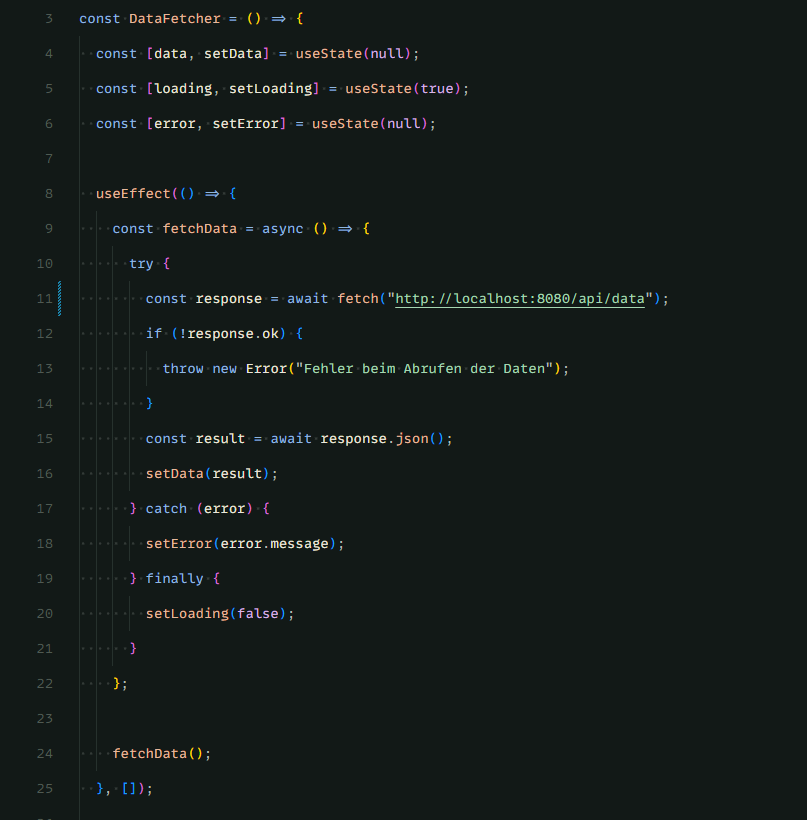

# 🌌 Spirited Forest Night — A Studio Ghibli inspired VS Code Theme

**Spirited Forest Night** is a cozy, dark theme inspired by the magical worlds of Studio Ghibli — especially *Spirited Away*, *My Neighbor Totoro*, and *Laputa: Castle in the Sky*.
Designed for peaceful coding, beautiful contrast, and soft colors that support focus and creativity.

---

## ✨ Features

- 🍃 Dreamy natural tones for strings, types, functions & keywords
- 🌙 Soft contrast and legibility optimized for long sessions
- 🎨 Designed for all major languages: JS/TS, Python, C/C++, PHP, HTML, etc.
- 💖 Crafted by a true Ghibli fan — for Ghibli fans

---

## 📸 Preview

---

## 📦 Installation

1. Open Extensions Marketplace in VS Code
2. Search for `Spirited Forest Night`
3. Click **Install** and enjoy the Ghibli vibes!

---

## 💬 Feedback & Contributions

Find a bug or want to suggest improvements?
Open an issue or PR at:
👉 [GitHub Repository](https://github.com/crydotsnake/spirited-forest-night)

---

🌱 *Let the forest guide your code.*
